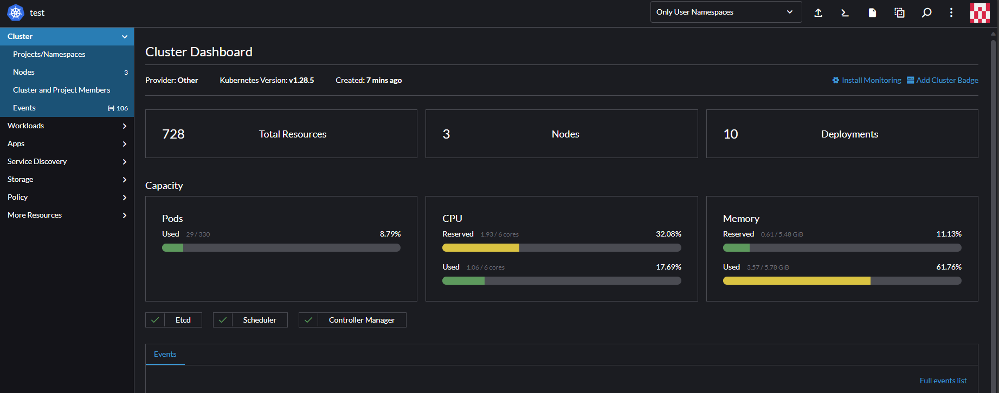
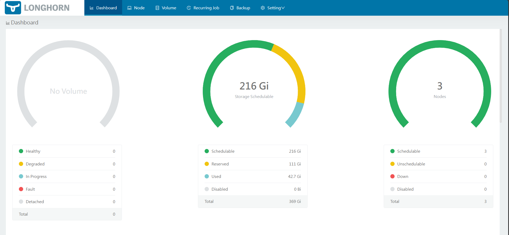
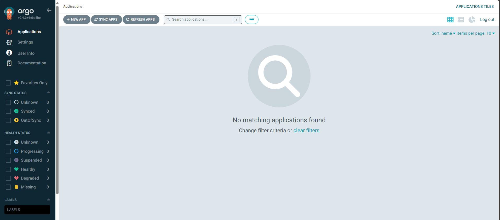
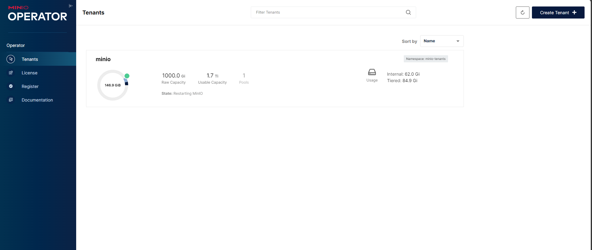

# Kubespray cluster

A example kubespray cluster that includes:

- Rancher with monitoring, logging operator
- CSI Longhorn
- Loki for store and query logs
- Keycloak single sign-on
- Argo CD - Declarative GitOps CD
- Minio - Object Storage
- Gitlab with keycloak

